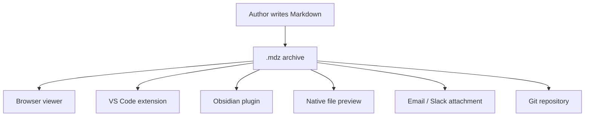
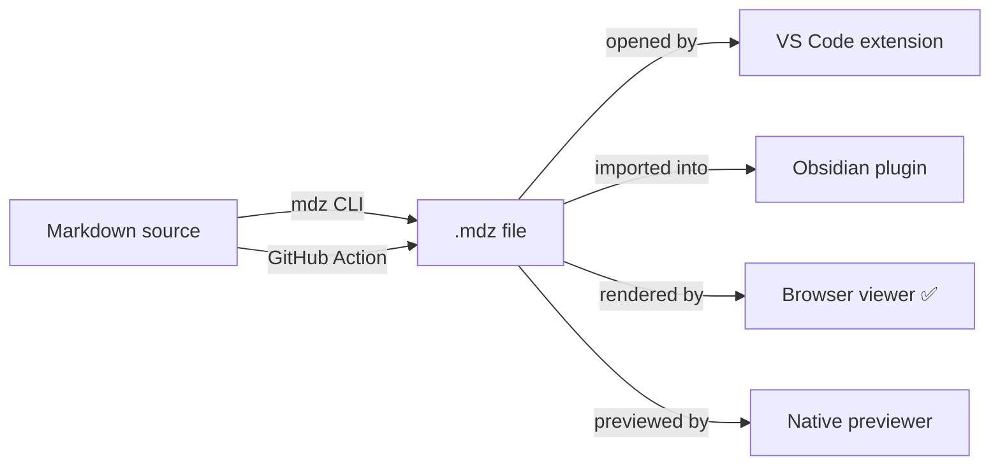

# Tools & Ecosystem

`.mdz` is an open format. Any tool that can read ZIP files can read `.mdz`. Here's how different tools relate to the format.

## How .mdz fits in the Markdown ecosystem



## The viewer stack

This browser viewer is built from three libraries:

| Library | Role |
|---------|------|
| [JSZip](https://stuk.github.io/jszip/) | Reads the ZIP archive in the browser |
| [marked](https://marked.js.org/) | Parses Markdown into HTML |
| [Mermaid](https://mermaid.js.org/) | Renders diagrams from code blocks |

Everything runs locally. No server, no upload, no network request for your document content.

## What the ecosystem could build

These tools don't exist yet — they're the natural next step:



## Creating an .mdz today

Until the CLI exists, you can create an `.mdz` with any ZIP tool:

```bash
# Using zip on macOS/Linux
zip -r my-document.mdz index.md assets/ manifest.json

# Using PowerShell on Windows
Compress-Archive -Path index.md, assets, manifest.json -DestinationPath my-document.zip
Rename-Item my-document.zip my-document.mdz
```

See the [Use Today](https://mdzip.org/today.html) page for more options.
